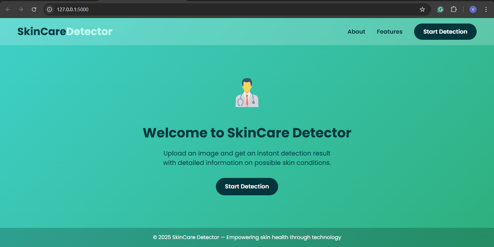
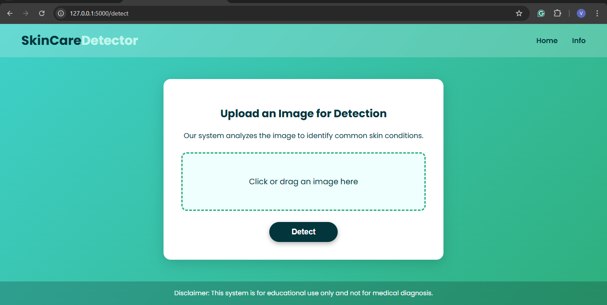
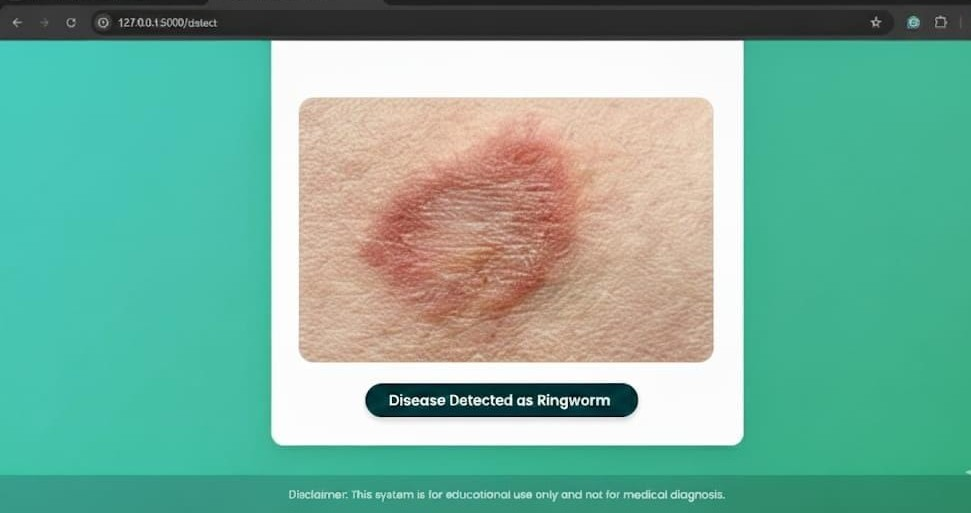
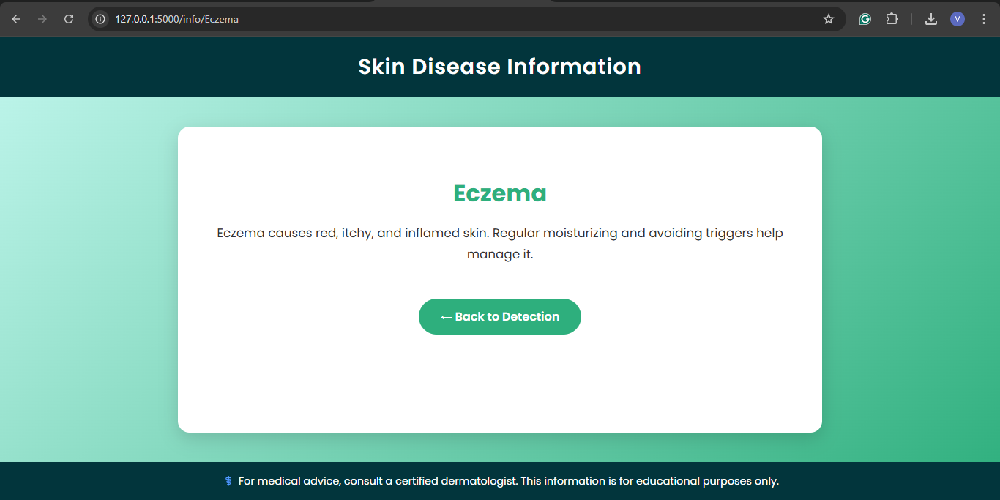

# Skin Disease Detection using AI & ML

This project uses machine learning techniques to detect different types of skin diseases based on image inputs.

## 🧠 Algorithms Used
- **MobileNetV2** for feature extraction  
- **SVM (Support Vector Machine)** for classification  
- **PCA (Principal Component Analysis)** for dimensionality reduction  

## ⚙️ Technologies Used
- **Frontend:** HTML, CSS, JavaScript  
- **Backend:** Flask (Python)  
- **Libraries:** TensorFlow, scikit-learn, OpenCV, NumPy  

### 🏠 Home Page

### 🔍 Detection Result

### ℹ️ Info and Feature Page

## 📊 Dataset
Images of various skin diseases collected from publicly available medical datasets.
https://www.kaggle.com/datasets/ismailpromus/skin-diseases-image-dataset/data

## 🚀 How to Run
1. Install dependencies:  
2.  pip install -r requirements.txt
3. py main.py
